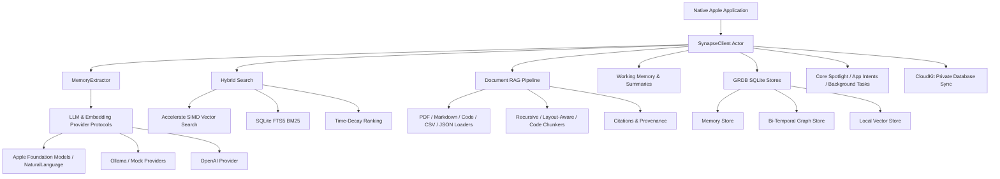

# SynapseMemory (synapse-memory-swift)

<p align="center">
  
  
  
  
  
</p>

**SynapseMemory** is an open-source, local-first Swift framework for persistent, structured memory on Apple platforms. It extracts memories and relationships from conversations, stores them in a local SQLite database, and retrieves them with hybrid vector, keyword, and recency search.

Built for native Apple applications, SynapseMemory combines Apple Foundation Models and NaturalLanguage, Accelerate SIMD vector math, SQLite FTS5, document RAG, Core Spotlight, App Intents, and optional CloudKit private-database synchronization in one Swift Package Manager library.

---

## 📊 Comprehensive Memory Feature Comparison Matrix

| Memory Capability | SynapseMemory (Native Swift) | Mem0 (Python / OSS) | Supermemory (Cloud) | Letta / MemGPT (Python) | Zep (Cloud / OSS) |
| :--- | :---: | :---: | :---: | :---: | :---: |
| **Native Apple Platforms (iOS, macOS, visionOS, watchOS)** | ✅ | ❌ | ❌ | ❌ | ❌ |
| **Swift 6 Strict Concurrency** | ✅ | ❌ | ❌ | ❌ | ❌ |
| **Local-First Execution with No Required Memory Server** | ✅ | ⚠️ | ❌ | ⚠️ | ❌ |
| **Conversational Memory Extraction and Updates** | ✅ | ✅ | ✅ | ✅ | ✅ |
| **Bi-Temporal Knowledge Graph Memory** | ✅ | ✅ | ❌ | ❌ | ✅ |
| **Entity and Relation Traversal** | ✅ | ⚠️ | ❌ | ⚠️ | ✅ |
| **Accelerate SIMD Vector Search** | ✅ | ❌ | ❌ | ❌ | ❌ |
| **SQLite FTS5 BM25 Keyword Search** | ✅ | ⚠️ | ⚠️ | ⚠️ | ⚠️ |
| **Hybrid Vector + Keyword + Time-Decay Ranking** | ✅ | ⚠️ | ❌ | ❌ | ⚠️ |
| **Hierarchical Working Memory Blocks** | ✅ | ❌ | ❌ | ✅ | ❌ |
| **Recall Log and Dialogue Summarization** | ✅ | ❌ | ❌ | ✅ | ✅ |
| **Multi-Format Document and Bookmark Ingestion** | ✅ | ⚠️ | ✅ | ⚠️ | ❌ |
| **Recursive, Code-Aware, and PDF-Aware Chunking** | ✅ | ❌ | ⚠️ | ❌ | ❌ |
| **Citation Tracking and RAG Context Construction** | ✅ | ❌ | ⚠️ | ❌ | ❌ |
| **On-Device Apple Foundation Models** | ✅ | ❌ | ❌ | ❌ | ❌ |
| **Local Ollama Provider** | ✅ | ⚠️ | ❌ | ⚠️ | ❌ |
| **OpenAI and Custom Provider Protocols** | ✅ | ✅ | ✅ | ✅ | ✅ |
| **Private Multi-Device CloudKit Sync** | ✅ | ❌ | ⚠️ | ❌ | ❌ |
| **Native Core Spotlight and Siri/App Intents** | ✅ | ❌ | ❌ | ❌ | ❌ |
| **Agent Tool Integration** | ✅ | ✅ | ✅ | ✅ | ✅ |

---

## 🏗 Architectural Overview



---

## 🌌 The Synapse Ecosystem Suite

SynapseMemory is the persistent context layer for the wider native Apple AI ecosystem:

| Subsystem | Framework | Capability Provided |
| :--- | :--- | :--- |
| **🤖 Agent** | [`synapse-agent-swift`](https://github.com/VM451/synapse-agent-swift) | Stateful agent orchestration, tool dispatch, multi-agent routing, and execution control |
| **🧠 Memory** | **`synapse-memory-swift`** | Conversational memory, bi-temporal graphs, hybrid search, RAG, working memory, and CloudKit sync |
| **🧪 Sandbox** | [`synapse-sandbox-swift`](https://github.com/VM451/synapse-sandbox-swift) | Isolated WebKit/WASM execution and token-efficient semantic page context |
| **🔍 Search** | [`synapse-search-swift`](https://github.com/VM451/synapse-search-swift) | On-device web search, scraping, and structured data extraction |

SynapseMemory exposes a JSON Schema tool surface for agent and model tool dispatch:

```swift
let toolSchema = SynapseMemoryAgentTools.toolsJSONSchemaString()
```

---

## ⚡ 30-Second Quickstart

```swift
import SynapseMemory

// 1. Initialize local memory with the default configuration
let memory = try await SynapseClient(config: SynapseConfig())

// 2. Extract memories and knowledge-graph relations from a conversation
try await memory.add(messages: [
    Message(role: .user, content: "I live in Bangkok and build native Swift apps."),
    Message(role: .assistant, content: "I will remember that.")
], userId: "alex_123")

// 3. Search with semantic, keyword, and recency scoring
let results = try await memory.search(
    query: "Where does Alex live?",
    userId: "alex_123"
)

for result in results {
    print("\(result.item.memory) — \(result.score)")
}
```

---

## 📖 In-Depth Documentation

For granular guides and comprehensive API references, see the **[`docs/`](docs/)** directory:

- 🚀 **[Getting Started](docs/getting-started/quick-start.md)**: Swift Package Manager installation and first memory flow.
- ⚙️ **[Configuration](docs/getting-started/configuration.md)**: `SynapseConfig`, providers, vector dimensions, and storage options.
- 🏛 **[Architecture Overview](docs/architecture/overview.md)**: Actors, memory tiers, local stores, and subsystem boundaries.
- 📊 **[Competitor Comparison](docs/architecture/competitor-comparison.md)**: Architectural comparison with Mem0, Supermemory, Letta/MemGPT, and Zep.
- 💬 **[Conversational Memory](docs/guides/conversational-memory.md)**: Add, update, delete, summarize, and recall memory operations.
- 🕸 **[Knowledge Graph](docs/guides/knowledge-graph.md)**: Entity extraction, relation storage, temporal facts, and graph traversal.
- 📄 **[Document Ingestion](docs/guides/document-ingestion.md)**: PDF, Markdown, code, CSV, JSON, Apple Notes, and multimodal ingestion.
- 🔎 **[Hybrid Search](docs/guides/hybrid-search.md)**: Accelerate vector similarity, SQLite FTS5, and time-decay fusion.
- 🧩 **[RAG Pipeline](docs/guides/rag-pipeline.md)**: Knowledge-base indexing, retrieval, citations, and context prompts.
- ☁️ **[CloudKit Sync](docs/guides/cloudkit-sync.md)**: Private database synchronization and delta change handling.
- 🍎 **[Apple Integrations](docs/guides/apple-integrations.md)**: Core Spotlight, App Intents, Siri, and background maintenance.
- 🤖 **[Agent Integration](docs/guides/agent-integration.md)**: Memory tools for SynapseAgent and other tool-calling runtimes.
- 🛈 **[API Reference](docs/api-reference/synapse-client.md)**: `SynapseClient` operations and retrieval APIs.

---

## 🧪 Testing

SynapseMemory includes **15 Swift test files** covering unit, integration, lifecycle, CloudKit, extraction, RAG, and performance behavior. Run the complete suite from the package directory:

```bash
swift test --disable-sandbox
```

---

## 📄 License

MIT License. Built for privacy-first memory in the Apple developer ecosystem.
