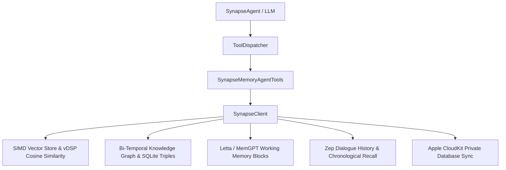

# SynapseMemory Agent Integration Guide

This guide details how to integrate **SynapseMemory** with **SynapseAgent** and native Apple Foundation Models to provide persistent long-term memory, working memory blocks, and knowledge graphs.

---

## 🏛️ Architecture Overview



---

## 🛠️ Tool Definitions & Dispatching

`SynapseMemoryAgentTools` exposes standardized tool definitions conforming to OpenAPI / JSON Schema:

- `memory_search`: Hybrid vector + keyword search across user facts and notes.
- `memory_add`: Add conversational turns, extract facts, update relationships.
- `memory_get_relations`: Query entity relationship triples (e.g. `Alex -> lives_in -> Bangkok`).
- `memory_get_core` & `memory_set_core`: Inspect and update working memory blocks.
- `memory_recall`: Chronological dialogue history log retrieval.
- `memory_ingest`: Ingest articles, bookmarks, and documents with auto-tagging.

---

## 🚀 Example: Connecting to SynapseAgent

```swift
import SynapseAgent
import SynapseMemory

// 1. Initialize SynapseClient
let memoryClient = try await SynapseClient(config: SynapseConfig())

// 2. Wrap into SynapseAgent Tool
let memoryTool = ClosureTool(
    name: "memorySearch",
    description: "Searches persistent long-term user memories",
    parametersSchema: [
        "type": AnySendable("object"),
        "properties": AnySendable([
            "query": AnySendable(["type": AnySendable("string"), "description": AnySendable("Search term")])
        ]),
        "required": AnySendable([AnySendable("query")])
    ]
) { args in
    try await SynapseMemoryAgentTools.handleToolCall(
        client: memoryClient,
        toolName: "memory_search",
        argumentsJSON: args
    )
}

// 3. Register with ToolRegistry
let registry = ToolRegistry()
registry.register(memoryTool)
```
